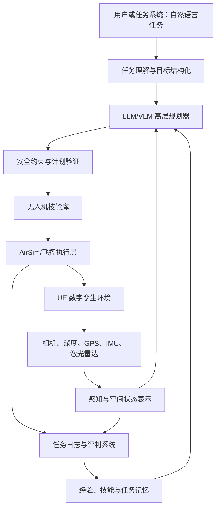

# 无人机多任务具身空间智能项目整体综述

> 已弃用并存档（2026-09-20，按项目负责人要求）。本文仅保留历史记录，不再用于确定开发范围、优先级或验收标准。整体路线以 [综述.md](../../综述.md) 为基准；近期工作见 [开发规划索引](../planning/README.md)。本文以下内容保持历史版本，其相对路径和状态描述也应按历史语境理解。

更新时间：2026-08-04

## 一、项目概述

本项目拟构建一个面向无人机遥感任务的具身空间智能仿真平台。平台以 Unreal Engine 数字孪生场景为环境，以无人机及其传感器为“身体”，以 AirSim 等飞控接口为执行通道，在此基础上逐步引入视觉感知、空间表示、任务规划、技能记忆、多智能体协同、强化学习和大语言模型能力。

项目的核心目标不是单纯让无人机在三维场景中飞行，也不是简单把大语言模型接到 AirSim，而是形成一个完整闭环：

> 无人机能够理解任务、感知环境、形成空间认知、选择和执行技能、根据反馈调整计划，并对任务结果进行评价。

这一平台可服务于森林巡检、灾害监测、目标搜索、遥感数据采集、道路或设施巡检、应急救援等典型任务，并作为后续多无人机协同和智能算法研究的统一实验环境。

## 二、项目背景与意义

传统无人机仿真项目通常侧重飞行动力学、遥控操作或单一算法验证，任务逻辑、环境理解和多任务迁移能力相对薄弱。与此同时，当前大语言模型已经具备自然语言理解、任务分解、代码生成、工具调用、图像理解和基于反馈修改计划的能力，为无人系统增加了新的高层认知方式。

具身智能强调智能体通过“感知—行动—反馈”与环境持续交互。大语言模型本身并不等于具身智能，但可以作为具身系统中的高层认知与规划模块：

- 将自然语言任务转化为结构化目标；
- 根据地图、状态和传感器摘要制定计划；
- 从技能库中选择可执行动作；
- 根据执行结果重新规划；
- 解释任务过程并生成结果报告。

无人机则提供空间运动能力、第一视角传感器和真实的任务约束。二者结合后，可以从“被动遥控工具”发展为“具有任务理解和自主决策能力的空间智能体”。

## 三、项目定位

本项目应定位为：

> 面向无人机遥感任务的、模型可替换、场景可扩展、技能可复用、结果可评价的具身智能仿真与训练平台。

需要明确以下边界：

- 项目不是重新设计底层飞控，而是在可靠飞控之上研究任务级智能。
- 项目不是只做聊天交互，而是要求语言决策最终落实为可验证的环境行动。
- 项目不是让 LLM 直接输出电机转速，而是让它调用经过约束的高级飞行技能。
- UE5 迁移是平台建设任务，不应被当作全部研究创新。
- 多机、强化学习和大模型属于后续深化方向，必须建立在单机任务闭环稳定的基础上。

## 四、总体技术架构



整个系统可以分为六层。

### 1. 仿真环境层

负责提供三维场景、物理碰撞、天气、光照、任务目标和数字孪生环境。当前使用打包好的 UE4.25.4 ModularNeighborhood 场景，未来计划建设可编辑的 UE5 工程。

### 2. 飞控与技能执行层

通过 AirSim RPC 等接口提供稳定、可测试的高级动作，例如：

- 起飞与降落；
- 飞往指定航点；
- 按速度或方向移动；
- 悬停和返航；
- 区域覆盖巡检；
- 定点或定时拍摄；
- 目标复查；
- 紧急停止与释放控制。

这一层负责把高层任务转化为确定性的飞行动作，并承担超时、限速、限高、边界和碰撞等安全约束。

### 3. 感知与空间表示层

统一处理无人机状态和传感器信息，包括：

- 位置、姿态、速度和飞行状态；
- RGB、深度、语义分割图像；
- GPS、IMU、磁力计、气压计和激光雷达；
- 障碍物、目标、已巡检区域和可通行空间；
- 局部地图、全局地图和任务相关空间记忆。

该层不应把所有原始数据持续发送给 LLM，而应先经过检测、压缩和结构化，只在需要语义判断时选择关键图像交给视觉语言模型。

### 4. 任务规划与智能体层

负责理解任务、拆解步骤、选择技能和处理异常。LLM 或其他规划器可以接收：

- 用户任务；
- 无人机当前状态；
- 地图和目标摘要；
- 可调用技能说明；
- 前一步的执行结果；
- 剩余时间、任务边界和安全约束。

规划器输出的应当是结构化技能调用，而不是自由文本或底层电机指令。例如：

```json
{
  "skill": "fly_to",
  "arguments": {
    "x": 12.0,
    "y": -4.0,
    "altitude": 5.0,
    "speed": 2.0
  },
  "reason": "前往下一巡检航点"
}
```

### 5. 记忆与学习层

用于保存能够复用的经验，而不只是不断扩充聊天上下文：

- 成功和失败的任务轨迹；
- 环境和目标的空间记忆；
- 已验证的飞行与遥感技能；
- 技能适用条件、参数和风险；
- 不同场景中的任务策略；
- 人工规则、强化学习策略和 LLM 计划之间的对比结果。

### 6. 任务评判层

对任务过程和结果进行自动评价，形成研究和训练所需的反馈信号。评价内容包括任务成功率、覆盖率、目标识别准确率、定位误差、飞行时间、路径长度、碰撞次数、无效调用次数、重新规划次数、数据质量和模型调用成本。

## 五、Minecraft 具身智能研究的参考价值

Minecraft 已经成为开放世界具身智能的重要实验环境。它同时包含三维空间、视觉信息、资源、工具、长程任务和环境反馈，因此非常适合研究“语言模型如何从任务理解走向环境行动”。

可参考的代表性工作包括：

- [Voyager](https://arxiv.org/abs/2305.16291)：使用 GPT-4 构建自动课程、可增长技能库和基于执行反馈的迭代机制。
- [Voyager 开源代码](https://github.com/MineDojo/Voyager)：展示 LLM、Minecraft 和 Mineflayer 工具层的实际连接方式。
- [STEVE](https://arxiv.org/abs/2311.15209)：将系统划分为视觉感知、语言指令和代码动作，并通过技能数据库完成动作检索。
- [MineDojo](https://minedojo.org/)：提供大量开放式、语言驱动的 Minecraft 任务和评测环境。
- [Mindcraft](https://github.com/mindcraft-bots/mindcraft)：支持通过不同 LLM 配置聊天、代码、视觉和记忆模块。
- [Minecraft MCP Server](https://github.com/yuniko-software/minecraft-mcp-server)：把 Mineflayer 能力封装为 MCP 工具，使 Claude Desktop 等智能体能够查询位置、移动、寻找物品、挖掘和放置方块。

这些项目证明了“LLM + 工具接口 + 环境反馈 + 技能记忆”是一条可行路线。它们最值得借鉴的是系统结构，而不是 Minecraft 本身。

无人机项目可以进行如下映射：

| Minecraft 智能体 | 无人机智能体 |
|---|---|
| 游戏世界 | UE/AirSim 数字孪生环境 |
| Minecraft 角色 | 无人机机体 |
| 方块、实体、背包 | 地图、目标、传感器和任务状态 |
| Mineflayer 动作 | AirSim RPC 飞行和取图接口 |
| 移动、挖掘、合成 | 起飞、巡检、拍摄、返航、降落 |
| 技能代码库 | 航线、搜索、复查和应急技能库 |
| 游戏任务完成条件 | 遥感覆盖率、识别结果和任务指标 |
| 环境执行反馈 | 飞行状态、图像结果、错误和碰撞信息 |

无人机环境与 Minecraft 的重要区别在于连续动力学、安全约束和空间误差更加突出。因此 LLM 更适合监督和调用高级控制器，而不是直接进行高频底层控制。Anthropic 的机器人实验也显示，前沿模型直接控制底层关节通常表现较差，使用高级工具或监督已有策略更可靠：[Claude plays robotics](https://www.anthropic.com/research/claude-plays-robotics)。

## 六、建议的智能体闭环

一个完整任务应采用以下循环：

1. **任务输入**：接收自然语言任务或标准任务文件。
2. **目标结构化**：提取区域、对象、时间、输出和安全约束。
3. **计划生成**：选择技能并生成有顺序的任务计划。
4. **安全检查**：验证高度、速度、边界、航点和剩余资源。
5. **技能执行**：由确定性控制器调用 AirSim。
6. **环境反馈**：返回状态、关键图像、检测结果和错误。
7. **完成判断**：继续、重试、重新规划或安全返航。
8. **结果评价**：生成指标、数据、日志和任务报告。
9. **经验沉淀**：将成功技能和失败原因写入记忆库。

第一版可以只向 LLM 暴露少量高级工具：

```text
get_drone_state()
takeoff(height)
fly_to(x, y, altitude, speed)
survey_area(boundary, altitude, overlap)
capture_rgb()
capture_depth()
inspect_target(target_id)
return_home()
land()
```

每个工具都应有参数范围、超时、前置条件、返回值和失败类型，执行层必须能够拒绝危险或无效计划。

## 七、代表性任务设计

建议以“区域巡检与目标搜索”作为项目主线任务：

> 无人机起飞后巡检指定区域，按照覆盖航线采集遥感图像；发现目标或异常后调整航线进行近距离复查，记录目标坐标和多模态数据，最后返回并生成任务报告。

这个任务能够逐步扩展为：

- 森林烟雾或火情巡检；
- 灾后受损建筑搜索；
- 道路、河道或电力设施巡检；
- 人员和车辆搜索；
- 农田长势或病害监测；
- 多无人机协同覆盖和动态任务分配。

第一版演示任务应控制在较小范围，例如：

> 起飞到 5 米，巡检前方 20×20 米区域；发现指定颜色车辆后拍摄 RGB 和深度图，记录坐标，然后返回并降落。

初期可以使用规则、颜色识别或现成检测器完成目标识别，把主要精力放在任务闭环和评测上；随后再替换为视觉语言模型。

## 八、当前项目基础

项目目前使用：

- UE4.25.4 ModularNeighborhood 打包场景；
- 旧版 Microsoft AirSim/AirLib；
- 共享 Python 3.13；
- Python AirSim 客户端和轻量 MessagePack RPC；
- 独立无人机控制台和安全启动器。

已经完成：

- 窗口化安全启动和全局退出热键；
- 自动处理汽车/四旋翼选择框；
- 不进入 UE 窗口的独立键盘和按钮控制；
- 默认载具、`Drone`、`Drone1` 自动回退连接；
- 起飞、移动、悬停和兼容性近地降落；
- 状态读取和相机图像获取；
- Python 3.13 基础兼容性测试；
- 无输入占用的隐藏自动验收。

最终验收曾成功得到：RPC 连接、110592 字节相机图像、约 2.1 米起飞高度、前移动作以及约 0.24 米近地锁定结果。

当前限制包括：

- 打包场景不能作为可编辑 UE 工程使用；
- `drone.json` 没有被该 EXE 稳定读取；
- 场景使用默认载具名，而不是稳定暴露 `Drone`；
- 原生着陆状态判定存在缺陷；
- 数据采集还没有形成固定输出和元数据流程；
- 基础自主航点任务尚未正式验收；
- UE5、多机、强化学习和 LLM 尚未接入。

详细技术交接见 `GPT账号迁移交接说明.md`，持续任务状态见 `项目后续完善清单.md`。

## 九、阶段实施路线

### 第一阶段：形成可展示的单机最小闭环

目标：完成老师 2026 年 8 月第一阶段要求。

- 完善人工飞控演示；
- 固化状态、RGB 和深度图采集；
- 建立统一数据输出目录和元数据格式；
- 完成小范围航点飞行；
- 实现拍照、返航和兼容性降落；
- 保存日志、截图和验收指标。

完成标志：用户能够一键运行一个“起飞—巡检—拍照—返航—降落”的任务，并检查输出数据。

### 第二阶段：建立技能化任务接口

- 将飞行和遥感动作封装成稳定技能；
- 定义统一的 JSON 输入输出协议；
- 增加参数验证、安全规则、超时和错误分类；
- 建立任务执行器、状态机和任务日志；
- 用固定规则规划器跑通全部技能。

完成标志：不接 LLM 也能通过结构化任务文件稳定完成任务。

### 第三阶段：接入模型可替换的 LLM 智能体

- 抽象统一的模型接口，避免绑定 Claude、GPT 或某一国产模型；
- 让 LLM 只负责任务理解、计划生成、技能选择和异常恢复；
- 增加安全计划验证器；
- 将环境反馈压缩成结构化观察；
- 保存每次模型调用、技能调用和重新规划记录。

完成标志：自然语言任务能够转换为受约束计划，并通过技能层完成一次真实仿真任务。

### 第四阶段：加入视觉、空间记忆与评判

- 接入目标检测、分割或 VLM；
- 建立已巡检区域、目标坐标和障碍物空间记忆；
- 建立任务完成判断和自动评判；
- 建立技能库和经验检索；
- 比较固定规划与 LLM 规划的性能。

完成标志：智能体可以根据视觉和任务反馈重新规划，而不是只执行预先生成的固定路线。

### 第五阶段：建设可编辑 UE5 平台

- 新建最小可编辑 UE5 工程；
- 选定明确兼容目标 UE 版本的仿真插件或后继方案；
- 在空白场景中先跑通单无人机、RPC 和相机；
- 再迁移或重建遥感场景；
- 将场景、载具和传感器参数外置；
- 建立 UE、插件、编译工具和客户端版本矩阵；
- 保持上层技能接口稳定，降低迁移成本。

当前能运行的 UE4 打包场景应保留为功能基准和回归测试环境。

### 第六阶段：多智能体与学习能力

- 多无人机区域划分和任务分配；
- 通信受限条件下的协同与重规划；
- 路径冲突检测和避碰；
- 强化学习策略训练；
- LLM 生成任务、课程或奖励函数；
- 多智能体经验共享和持续学习。

## 十、评测体系

项目应从早期就建立评测，而不是只展示视频。

### 任务结果指标

- 任务成功率；
- 区域覆盖率；
- 目标检出率、误检率和定位误差；
- 有效图像比例和数据完整率；
- 是否安全返航和降落。

### 飞行效率指标

- 总航程；
- 总耗时；
- 平均和最大速度；
- 路径冗余；
- 碰撞次数；
- 超出边界或高度限制次数。

### 智能体指标

- 计划有效率；
- 无效工具调用次数；
- 重新规划次数；
- 异常恢复成功率；
- 技能复用率；
- 模型延迟、Token 消耗和调用成本。

### 推荐实验对照

至少比较以下方法：

1. 固定规则或预设航线；
2. 传统路径规划；
3. LLM 直接生成一次性任务计划；
4. LLM 加环境反馈重新规划；
5. LLM 加技能库和任务记忆；
6. 后期的强化学习或多智能体方法。

## 十一、预期创新点

项目可以从以下方面形成区别于普通 AirSim 示例的创新：

1. **面向遥感任务的具身智能闭环**：将空间感知、飞行技能、任务规划和结果评判统一起来。
2. **模型可替换的高层智能接口**：Claude、GPT、国产模型或本地模型共享同一套技能和任务协议。
3. **安全分层控制**：LLM 不直接控制电机，而是通过受约束技能执行复杂任务。
4. **任务技能库与经验记忆**：保存可验证、可迁移的巡检、搜索、复查和返航技能。
5. **多模态空间反馈**：结合图像、深度、位姿和地图进行计划修正。
6. **自动评判和对比实验**：将任务完成度、飞行安全、规划效率和模型成本纳入统一指标。
7. **从旧版 AirSim 到 UE5 平台的接口延续**：通过适配层保护上层任务代码，减少仿真平台迁移带来的重写。

## 十二、主要风险与应对

### 1. 旧平台限制

风险：当前打包场景不可编辑、配置加载异常、着陆判定存在缺陷。  
应对：将其作为短期演示和回归基准，长期在 UE5 重建可编辑环境。

### 2. LLM 幻觉和非法计划

风险：模型可能生成不存在的工具、越界航点或不安全动作。  
应对：使用结构化输出、工具白名单、参数校验、安全状态机和强制返航策略。

### 3. 模型延迟与成本

风险：高频发送图像和状态会造成延迟、Token 消耗和费用。  
应对：低层控制本地化，只在任务节点或异常发生时调用 LLM/VLM，并对观察信息进行摘要。

### 4. 评价不充分

风险：项目变成主观演示，无法证明方法有效。  
应对：从第一版任务开始保存日志并设置固定任务、随机种子、对照方法和量化指标。

### 5. 仿真到现实差距

风险：仿真中的视觉、动力学和定位误差与真实无人机不同。  
应对：当前只宣称仿真能力；后续通过噪声、风、传感器误差、延迟和域随机化提高鲁棒性，再讨论真机迁移。

### 6. 设备稳定性和输入捕获

风险：旧 UE 场景负载较高，UE 窗口会捕获鼠标，用户电脑曾发生系统级输入失效和重启。  
应对：保持窗口化、独立控制台、隐藏自动验收、全局退出热键、超时和进程清理；未经说明不直接启动可见仿真。

## 十三、预期成果

### 近期成果

- 可安全运行的无人机仿真和控制台；
- 状态、RGB 和深度数据采集工具；
- 航点巡检、拍照、返航和降落任务；
- 统一日志、数据目录和验收报告；
- 项目运行说明和演示视频。

### 中期成果

- 标准化无人机技能库；
- 自然语言任务规划智能体；
- 基于图像和空间反馈的重新规划；
- 任务评判系统；
- 可编辑 UE5 仿真工程和版本兼容文档。

### 长期成果

- 多任务、多场景无人机具身智能平台；
- 多无人机协同和动态任务分配；
- 强化学习与 LLM/VLM 混合决策；
- 标准任务集、数据集和评测基准；
- 面向智慧遥感、低空经济和智能无人系统研究的开放实验平台。

## 十四、当前最重要的下一步

当前不应立即接入 Claude 或 GPT。下一步应按以下顺序完成：

1. 建立一键状态、RGB 和深度图采集脚本，保存图像及对应位姿元数据。
2. 完成小范围“起飞—航点—拍照—返航—降落”任务。
3. 将上述能力封装为有明确输入、输出、超时和错误类型的技能。
4. 用规则任务文件验证技能层稳定性。
5. 再接入第一个模型可替换的 LLM 规划器。

完成前三步后，项目就具备了类似 Minecraft 智能体中的“环境、身体、工具和反馈”；接入 LLM 才能成为真正可验证的认知—行动闭环，而不是停留在概念展示。
